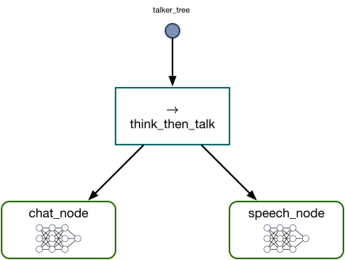

# 1. Building a Chat System with Dendron: Thinking and Talking

In the [Part 0](0_tutorial_single_node.md), we created a simple Dendron behavior tree with a single `CausalLMAction` node and used that tree to implement a chat loop. In this part of the tutorial, we will expand the capabilities of our agent by giving it the power of speech. This will require us to use Dendron's control flow capabilities, since we'll only want our agent to speak when it has something new to say. 

!!! tip

    Current SOTA text-to-speech (TTS) models appear to be a bit on the slow side, at least on consumer cards like the single 3090 I'm developing with. If you want an agent that can talk but find the latency of neural TTS unbearable, try replacing the `TTSAction` we implement below with an action that uses an old-fashioned TTS system like espeak on Linux. I found that the `pyttsx3` library was useful in this regard.

If you find this tutorial too verbose and you just want to get the code, you can find the notebook for this part [here](https://github.com/RichardKelley/dendron-examples/blob/main/tutorial_1/part_1.ipynb){:target="_blank"}.

## Imports and Bark TTS

We'll start out by importing the libraries we need to implement TTS, beginning of course with Dendron:

```python linenums="1"
import dendron
from dendron.actions.causal_lm_action import CausalLMActionConfig, CausalLMAction
```

We import `CausalLMAction` as in Part 0 to create a chat node. We are going to create a custom `dendron.ActionNode` to implement our TTS capability, so next we import the components we need specifically for speech generation:

```python linenums="1"
import torch
from transformers import BarkModel, BarkProcessor
from optimum.bettertransformer import BetterTransformer
import sounddevice as sd
```

We are going to be using the [bark-small model](https://huggingface.co/suno/bark-small){:target = "_blank"} for our text to speech capability. The combination of the quantized `openchat_3.5` model and `bark-small` uses about 4.7GB of VRAM on my GPU.

## Creating a Custom Dendron Action Node

We want to create an action node that generates some speech and actually says it. We'll show the whole node and then walk through the parts:

```python linenums="1"
class TTSAction(dendron.ActionNode):
    def __init__(self, name):
        super().__init__(name)
        self.processor = BarkProcessor.from_pretrained("suno/bark-small")
        self.model = BarkModel.from_pretrained("suno/bark-small").to("cuda")
        self.model = BetterTransformer.transform(self.model, keep_original_model=False)
        self.model.enable_cpu_offload()

    def tick(self):
        try:
            input_text = self.blackboard["speech_in"]
            inputs = self.processor(text=input_text, voice_preset="v2/en_speaker_9", return_tensors="pt").to("cuda")
            self.blackboard["speech_out"] = self.model.generate(**inputs).cpu().numpy()
        except Exception as e:
            print("Speech generation exception: ", e)
            return dendron.NodeStatus.FAILURE
        
        return dendron.NodeStatus.SUCCESS
```

We can declare a new action node type by inheriting from `dendron.ActionNode`, which we do here. The parent class constructor requires us to specify a name for our node, so we take `name` as a parameter and forward that up to the parent in `super().__init__(name)`. Then we initialize our model. Instead of a tokenizer we have a `BarkProcessor` that achieves the same effect. We initialize a processor from the Hugging Face Hub, and then we initialize our model and send it to the GPU. The next two steps (lines 6 and 7) are optional optimizations.

The only member function we _need_ to define to implement a Dendron node is `tick(self)`. In general, a `tick` function should take no inputs and _must_ return a `NodeStatus`. In our case, we `try` to get some input text from `self.blackboard`, run it through the processor, call our TTS model's `generate` function, and write the output back to `self.blackboard`. If all goes well, we return `NodeStatus.SUCCESS`. If there's an exception, we print it out and then return `NodeStatus.FAILURE`. This is representative of the general flow of a `tick` function. 

There are some interesting details, such as the `voice_preset` option in the `processor` call. If you want to experiment with other voices (or other languages), you can see a list of voice options [here](https://suno-ai.notion.site/8b8e8749ed514b0cbf3f699013548683?v=bc67cff786b04b50b3ceb756fd05f68c){:target="_blank"}.

## Pre- and Post-Tick Functions

The call to `generate` on line 13 above will generate the audio data we want to play, but won't in fact play a sound. To do that, we need to use the `sounddevice` library that we imported above. If our `TTSAction` class had a member function that used `sounddevice` then we'd be all set. You might imagine a function like `play_speech` that can play the sound data directly from memory (on Ubuntu at least):

```python linenums="1"
def play_speech(self):
    sd.play(self.blackboard["speech_out"][0], self.model.generation_config.sample_rate)
    sd.wait()
```

After the `tick` function has returned, the audio data is stored in the blackboard and the `play_speech` function above could play it correctly. We just need a way to ensure that `play_speech` is called immediately after the `tick` function returns. It often happens that we want to execute code for its side effects immediately surrounding a `tick` call, and Dendron supports this with "pre-tick functions" and "post-tick functions." These are functions that get added as members of our node classes that are guaranteed to be called before and after a `tick`. Each `TreeNode` maintains a list of pre-tick and post-tick functions, and calls them in the order they are added. To see how this works, we first instantiate our node and then add our `play_speech` post-tick function to the node: 

```python linenums="1"
speech_node = TTSAction("speech_node")
speech_node.add_post_tick(play_speech)
```

Now that we've introduced pre- and post-tick functions into the mix, we can see that a more accurate depiction of a `tick` call looks something like the following:

<center>
<markdown figure>
{:width="600px"}
</figure>
</center>

(It's an implementation detail, but these operations all take place inside of a method called `execute_tick` that is responsible for the sequence of operations in the figure above. You will never need to override `execute_tick` in your own node classes as long as you implement a reasonable `tick` operation and use pre- and post-tick functions correctly.)

With this, our `TTSAction` node is ready to go. It just needs something to say, so next we create a chat node.

## A Chat Node

To create our chat node, we will follow almost exactly the same steps as in the previous part. We'll start by creating a `CausalLMActionConfig` and then we'll use that configuration to instantiate a `CausalLMAction`. Then we'll define our input and output processor functions to translate between strings and the structured format that `openchat_3.5` expects:

```python linenums="1"
chat_behavior_cfg = CausalLMActionConfig(load_in_4bit=True,
                                         max_new_tokens=128,
                                         do_sample=True,
                                         top_p=0.95,
                                         use_flash_attn_2=True,
                                         model_name='openchat/openchat_3.5')

chat_node = CausalLMAction('chat_node', chat_behavior_cfg)

def chat_to_str(self, chat):
    return self.tokenizer.apply_chat_template(chat, tokenize=False, add_generation_prompt=True)

def str_to_chat(self, str):
    key = "GPT4 Correct Assistant:"
    idx = str.rfind(key)
    response = str[idx+len(key):]
    chat = self.blackboard[self.input_key]
    chat.append({"role" : "GPT4 Correct Assistant", "content" : response})
    return chat

chat_node.set_input_processor(chat_to_str)
chat_node.set_output_processor(str_to_chat)
```

So far this is identical to our previous chat system. But now we need to connect the output of our `chat_node` with the input of our `speech_node`. Having them communicate this information directly would violate the design constraint of behavior trees, so instead we'll have them communicate via their shared blackboard. Setting a blackboard is a side effecting operation, and post-tick functions are generally a good place to perform node operations that are partly or entirely used for their side effects, so we'll define a function `set_next_speech` and add it as a post-tick function for `chat_node`:

```python linenums="1"
def set_next_speech(self):
    text_output = self.blackboard["out"][-1]["content"]
    self.blackboard["speech_in"] = " " + text_output

chat_node.add_post_tick(set_next_speech)
```

Now our `chat_node` and our `speech_node` are completed. We just need to combine them into a single composite operation in a behavior tree.

## Composing Nodes with `Sequence`

In our new chat loop, we want our agent to read our input, generate a response with `chat_node`, and generate audio using `speech_node`. This implies a _sequential_ ordering to the `tick` operation for our tree. We can compose two or more nodes in sequence using a _control node_. Dendron provides two types of control nodes: `Fallback` and `Sequence`. We'll talk about `Fallback` in the [next part](2_tutorial_implicit_seq.md). A `Sequence` node keeps a list of children, and ticks them in order until either:

* One of the children returns `NodeStatus.FAILURE`, in which case the `Sequence` node fails, or
* All of the children return `NodeStatus.SUCCESS`, in which case the `Sequence` node succeeds.

We can compose our two nodes with a `Sequence` object and create a tree from the result as follows:

```pything linenums="1"
root_node = dendron.controls.Sequence("think_then_talk", [
    chat_node,
    speech_node
])

tree = dendron.BehaviorTree("talker_tree", root_node)
```

Both `Sequence` and `Fallback` reside in `dendron.controls`. A control node is like an action node in that its first argument is a string name. But the second argument to a control node is a list of children. The children are `tick`ed in the order they are given in the constructor. You can also add children dynamically to a control node after it is constructed. See the [`ControlNode` documentation](api/control_node.md){:target="_blank"} for details.

At this point our tree is ready for use. We can visually represent the tree as follows:

<center>
<markdown figure>

</figure>
</center>

The `Sequence` node is represented by a rightward pointing arrow; this is standard in much of the behavior tree literature. The children of a control node should be read from left to right to understand the sequencing. The dark circle indicates the root. In this case calling the `tick` function will send a tick signal to the `think_then_talk` node first. This node will in turn first tick `chat_node`, and if `chat_node` returns `NodeStatus.SUCCESS` then `think_then_talk` will subsequently tick `speech_node`. This is precisely the behavior we wanted, and how we set up the flow of data through `tree.blackboard`.

!!! Tip

    This is the first time we have had to connect two nodes via a blackboard. It can be very helpful to think about blackboard state and `tick` operations in terms of pre-conditions and post-conditions. For each `TreeNode` that needs to communicate with other nodes, ask what state it requires from the blackboard to run its `tick` operation (pre-conditions) and what state it ensures will hold in the blackboard after its `tick` operation completes (post-conditions). I have found it helpful to "work backwards" from the end of a tree's tick logic to the beginning.

## The Chat Loop

Our agent is now ready to talk to us. Since we're still managing the chat state outside of our behavior tree, you'll find that the logic is quite similar to the previous part:

```python linenums="1"
chat = []

while True:
    input_str = input("Input: ")
    chat.append({"role": "GPT4 Correct User", "content" : input_str})
    tree.blackboard["in"] = chat
    tree.tick_once()
    print("Output: ", tree.blackboard["out"][-1]["content"])
    if "Goodbye" in tree.blackboard["out"][-1]["content"]:
        break
```

If you've gotten to this point, congratulations! You have built a local chat agent that can talk to you. Not quite C-3PO, but I'd say pretty remarkable nonetheless.

## Conclusion

If you run our agent now, you'll find that you can type your end of the chat, but the agent speaks! Amazing. But if you play with this agent long enough, you'll find that its TTS capabilities are ... sometimes mixed. This appears to be common among neural TTS systems: they struggle with long outputs. If you play with the model long enough, you'll find that even with a limit on its output `chat_node` often generates strings that `speech_node` cannot speak. We'll see one way to (mostly) solve this problem in [part 3](3_tutorial_llm_conditional.md). But before we do that, we need to learn a powerful pattern in behavior tree design, which we'll introduce in [the next part](2_tutorial_implicit_seq.md) by moving the chat management logic into our behavior tree.
