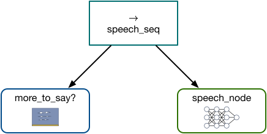
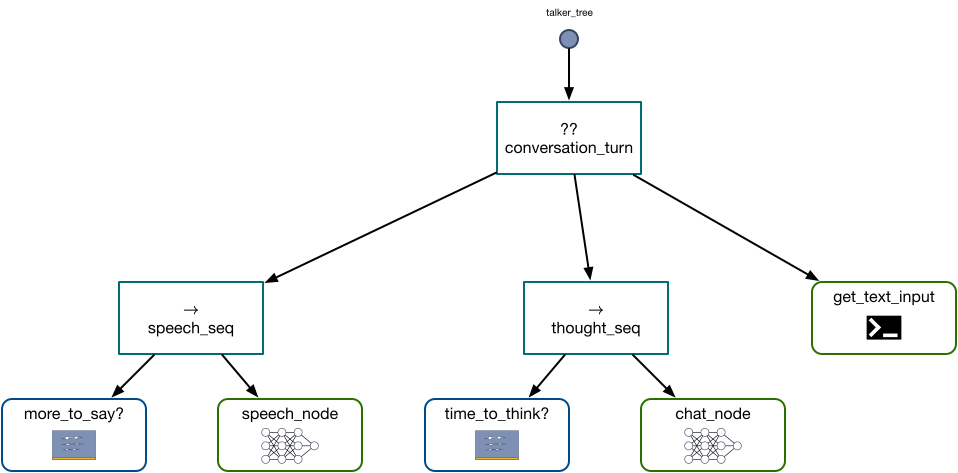

# 2. Building a Chat System with Dendron: Managing Chat State

In the [Part 1](1_tutorial_seq.md) we saw how to get a `CausalLMAction` node to work with a custom `dendron.Action` node to generate speech in a chat loop. To do that, we `tick`ed the nodes in order using a `Sequence` control node. In this part we'll see how to move our chat state management into our tree, which we'll find ultimately increases the flexibility of our agent.  

If you find this tutorial too verbose and you just want to get the code, you can find the notebook for this part [here](https://github.com/RichardKelley/dendron-examples/blob/main/tutorial_1/part_2.ipynb){:target="_blank"}.

## Imports and a Text Input Node

As before, we begin by importing the code we need:

```python linenums="1"
import dendron
from dendron.actions.causal_lm_action import CausalLMActionConfig, CausalLMAction
from dendron.controls import Sequence, Fallback
from dendron import NodeStatus

import torch
from piper import PiperVoice
import numpy as np
import sounddevice as sd
```

In addition to importing `dendron` and our `CausalLMAction` node, we're going to explicitly import `Sequence` and `Fallback` from `dendron.controls`, and `NodeStatus` from `dendron`. As our trees get larger and we have more custom components, you'll find that these imports make the code a bit more concise.

Our goal is to handle the entirety of the chat loop inside our behavior tree. We will need some new logic to do that, but before we get there we'll need to move human text input into the tree as well. We can implement this with an `ActionNode` as follows:

```python linenums="1"
class GetTextInput(dendron.ActionNode):
    """
    PRE: None
    POST: 
        blackboard[latest_human_input_key] = input
        blackboard["in"] = chat
    """
    def __init__(self, latest_human_input_key = "latest_human_input"):
        super().__init__("get_text_input")
        self.latest_human_input_key = latest_human_input_key
    
    def tick(self):
        self.blackboard[self.latest_human_input_key] = input("Human: ")

        chat = self.blackboard["chat_history"]
        chat.append({"role": "GPT4 Correct User", "content" : self.blackboard[self.latest_human_input_key]})
        self.blackboard["in"] = chat
        
        return NodeStatus.SUCCESS
```

Here you can see that I have explicitly written out the pre- and post-conditions for the blackboard state as a design aid. When ticked, a `GetTextInput` node gets a string input from the human, and writes it to the blackboard at whatever key is specified in the constructor. The node then updates the chat history that it is maintaining before returning `NodeStatus.SUCCESS`. 

## Implicit Sequences for Behavior Tree Design

You might think that at this point we could just put a `GetTextInput` node at the front of our sequence from the last part and we would be done. You might be able to make that work (try it!), but we're going to do something a little different and explore a behavior tree design pattern that often leads to much more flexible reactive agents. The pattern is "implicit sequences," and it uses `Fallback` nodes to implement a sequence of behaviors. A `Fallback` node is a control node, so it maintains a list of children that it ticks in succession. But in contrast with the `Sequence` node that we described in the last part, a `Fallback` node ticks its children in order until:

* One of the children returns `NodeStatus.SUCCESS`, in which case the `Fallback` node succeeds, or
* All of the children return `NodeStatus.FAILURE`, in which case the `Fallback` node fails.

You can compare this with the description of `Sequence` nodes to see that `Fallback` and `Sequence` are "conjugate" or "dual" to each other in some sense. Intuitively, a `Fallback` node is "trying" its children in order from left to right until one of them works. So one way you can think of `Fallback` is that it provides a mechanism to implement contingent behaviors in the presence of failure. But failure should be understood very broadly in the context of behavior trees: often in this context `SUCCESS` and `FAILURE` are taken as synonyms for `True` and `False`, so that failure doesn't necessarily represent an exceptional or even adverse state in a behavior tree. 

In an _implicit sequence_, instead of executing a sequence of tasks "A -> B -> C", we attach a predicate to each task that returns `True` if and only if it is currently appropriate to execute that task. We then query these predicates in **reverse order**, which looks something like:

* Is C ready to execute? If so do C. Otherwise keep going.
* Is B ready to execute? If so do B. Otherwise keep going.
* Is A ready to execute? If so do A. Otherwise give up.

If the tasks are related to each other, so that doing A makes it so that B becomes ready and doing B makes C become ready, then this evaluation strategy implements the same ordering as a direct sequence. In a static world, an implicit sequence is identical to a regular sequence. But if your agent is in a dynamically varying world then we can query an implicit sequence in a tight loop to make our agent react to changing conditions driven by external forces. This property is one of the reasons that implicit sequences and behavior trees have become popular in game development and robotics. 

!!! info

    For more details on the theory behind implicit sequences, see the wonderful textbook [Behavior Trees in Robotics and AI: An Introduction](https://arxiv.org/abs/1709.00084){:target="_blank"} by Michele Colledanchise and Petter Ogren.

We can use an implicit sequence to manage our chat state. We'll have three tasks. Anthropomorphizing a bit (too much?), we'll call them "speaking," "thinking," and "listening." The listening is implemented by our `GetTextInput` node above, so next we'll show how combining speaking and thinking in an implicit sequence will lead to a better agent.

### The Speech Sequence

To see how we can use the implicit sequence concept in our design, take a moment to think about how you engage in conversation with other humans. You likely don't just start talking at arbitrary points in time. Instead, you probably (explicitly or implicitly) ask yourself "is now a good time to talk?" and then open your mouth precisely when your answer to that question is "yes." We can model this in a behavior tree with a `Sequence` node that first ticks a `ConditionNode` that queries if now is a good time to speak, followed by our old friend `speech_node`:

<center>
<markdown figure>
{:width="400px"}
</figure>
</center>

In this configuration, our `more_to_say?` condition node is effectively acting as a "guardrail" that only allows `speech_node` to `tick` when the agent actually has something to say. What determines if the agent has something to say? We'll track this with the blackboard (the image in the `more_to_say?` node above is a blackboard with squiggles on it):

```python linenums="1"
class MoreToSay(dendron.ConditionNode):
    def __init__(self, speech_input_key="speech_in"):
        super().__init__("more_to_say")
        self.speech_input_key = speech_input_key

    def tick(self):
        if self.blackboard[self.speech_input_key] != []:
            return dendron.NodeStatus.SUCCESS
        else:
            return dendron.NodeStatus.FAILURE
```

From the code above, you can see that we're going to keep track of a blackboard entry that tells us if there is any text that needs to be spoken. It might seem a little odd that we are comparing the value at that entry to an empty _list_, since you might think that the entry should be a string. But it will turn out to be more convenient to work with a list of strings for reasons we'll see in the next part of the tutorial.

To complete the speech sequence, we'll repeat the `TTSAction` code here:

```python linenums="1"
class TTSAction(dendron.ActionNode):
    def __init__(self, name):
        super().__init__(name)
        self.voice = PiperVoice.load("en_US-danny-low.onnx", config_path="en_US-danny-low.onnx.json", use_cuda=False)
        
    def tick(self):
        try:
            input_text = self.blackboard["speech_in"].pop() 
            self.blackboard["speech_out"] = self.voice.synthesize_stream_raw("\t" + input_text, sentence_silence=0.1)
        except Exception as e:
            print("Speech generation exception: ", e)
            return dendron.NodeStatus.FAILURE

        return dendron.NodeStatus.SUCCESS

def play_speech(self):
    audio_stream = self.blackboard["speech_out"]
    for sent in audio_stream:
        audio = np.frombuffer(sent, dtype=np.int16)
        a = (audio - 32768) / 65536
        sd.play(a, 16000)
        sd.wait()
```

This is almost identical to the `TTSAction` from the previous part of the tutorial, except that on line 11 we are `pop()`ing the input text from the blackboard entry. This relates again to our use of a list, the utility of which will become clear later on. For now, we can create an instance of these two classes and create a speech sequence:

```python linenums="1"
speech_node = TTSAction("speech_node")
speech_node.add_post_tick(play_speech)

speech_seq = Sequence("speech_seq", [
    MoreToSay(),
    speech_node
])
```

### The Thought Sequence

Next we want to implement a "thinking" sequence similar to the speech sequence we described in the previous section. The general outline will be similar: first we ask if it's time to think, and then if it is we'll run a `chat_node` to generate some text to speak. First the `TimeToThink` condition node:

```python linenums="1"
class TimeToThink(dendron.ConditionNode):
    """
    PRE:
        blackboard[human_input_key] should be set
    POST:
    """
    def __init__(self, human_input_key = "latest_human_input"):
        super().__init__("time_to_think")
        self.human_input_key = human_input_key
        self.last_human_input = ""
    
    def tick(self):
        human_input = self.blackboard[self.human_input_key]
        if self.last_human_input == human_input:
            status = NodeStatus.FAILURE
        else:
            status = NodeStatus.SUCCESS

        self.last_human_input = human_input
        return status
```

Here, our node checks the blackboard to see the current human input. That is compared against the last input the node has seen. If they are the same, the node fails (and we will move on to get a new input from the human). If they are not the same then we succeed and continue to tick the `chat_node`. 

Our `chat_node` is identical to previous versions:

```python linenums="1"
chat_behavior_cfg = CausalLMActionConfig(load_in_4bit=True,
                                         max_new_tokens=128,
                                         do_sample=True,
                                         top_p=0.95,
                                         use_flash_attn_2=True,
                                         model_name='openchat/openchat-3.5-0106')

chat_node = CausalLMAction('chat_node', chat_behavior_cfg)

def chat_to_str(self, chat):
    return self.tokenizer.apply_chat_template(chat, tokenize=False, add_generation_prompt=True)

def str_to_chat(self, str):
    key = "GPT4 Correct Assistant:"
    idx = str.rfind(key)
    response = str[idx+len(key):]
    chat = self.blackboard[self.input_key]
    chat.append({"role" : "GPT4 Correct Assistant", "content" : response})
    return chat
    
def set_next_speech(self):
    text_output = self.blackboard["out"][-1]["content"]
    self.blackboard["speech_in"].append(text_output)

chat_node.set_input_processor(chat_to_str)
chat_node.set_output_processor(str_to_chat)
chat_node.add_post_tick(set_next_speech)
```

!!! tip

    If the logic connecting `TimeToThink` with `chat_node` is not clear, you may find it helpful to _enable logging_. You can do this for a tree by calling `tree.enable_logging()`. By default this will print logging information to the screen, but you can direct that output to file by calling `tree.set_log_filename(file)`. You can switch back to printing by calling `tree.set_log_filename(None)` and you can turn logging off by calling `tree.disable_logging()`.

With all the above set up, we can create our `thought_seq` object:

```python linenums="1"
thought_seq = Sequence("thought_seq", [
    TimeToThink(),
    chat_node
])
```

## The Completed Tree

All that remains is to compose our sequence nodes into an implicit sequence via a `Fallback`, set up our blackboard, and start chatting. The tree composition looks like this:

```python linenums="1"
root_node = Fallback("conversation_turn", [
    speech_seq,
    thought_seq,                
    GetTextInput()
])
tree = dendron.BehaviorTree("talker_tree", root_node)
```

The resulting tree looks like the following (`Fallback` nodes are typically denoted by question marks):

<center>
<markdown figure>

</figure>
</center>

Then all we have to do is initialize the blackboard and we can start our chat loop:

```python linenums="1"
tree.blackboard["chat_history"] = []
tree.blackboard["speech_in"] = []
tree.blackboard["latest_human_input"] = ""

while True:
    tree.tick_once()
```

You should again be able to type to your program and have it reply with speech. You'll need to manually terminate your program since we don't have a check for `"Goodbye"` anymore. 

## Conclusion

We now have moved all the management of chat state into our behavior tree. This may feel like a lot of work to get back to where we were at the end of Part 1, but in the [next part](3_tutorial_llm_conditional.md) we'll see how managing the chat state inside the tree allows us to add another language model that will analyze the human's input to decide whether it would be appropriate to end the conversation.