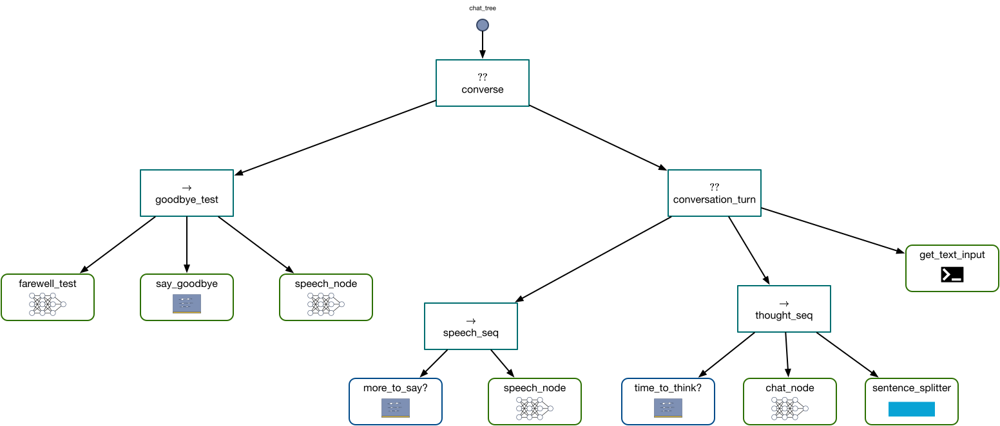

# 3. Building a Chat System with Dendron: Learning How to Say Goodbye

In [Part 2](2_tutorial_implicit_seq.md) we saw how to manage the state of a chat inside of a behavior tree, but we lost the ability to determine when the user wants to end the conversation. Even so, if you played with the models from Parts 0 or 1, you may have noticed that a simple search for the string `"Goodbye"` doesn't necessarily lead to a reliable indicator that the conversation is over: even if you say goodbye to your agent, it may not reply in kind, or it may not say the exact word you're searching for. We could try to add complexity to our exact search, but what we really want is to look at whatever the human has said most recently and answer the question "Is the human trying to end the conversation?" This is precisely the sort of thing that language models are supposed to be good at, and Dendron provides a specific class (`CompletionCondition`) that uses a language model to _score_ a list of possible answers to a question, returning the most likely answer given the model and some programmer-specified context. In this part we'll show how to add a `CompletionCondition` to our tree to end the conversation with a bit more intelligence than our previous trees. We'll also add a rule-based AI node for intelligently splitting long strings into shorter ones to improve TTS quality.

## Imports and Initial Setup

We start as always with our imports:

```python linenums="1"
import dendron
from dendron.actions.causal_lm_action import CausalLMActionConfig, CausalLMAction
from dendron.conditions.completion_condition import CompletionConditionConfig, CompletionCondition
from dendron.controls import Sequence, Fallback
from dendron import NodeStatus

import torch
from transformers import BarkModel, BarkProcessor
from optimum.bettertransformer import BetterTransformer

from spacy.lang.en import English 

import time
import numpy as np
import sounddevice as sd
```

Most of this should be familiar from the previous parts, but a few points of interest do stand out. First, we import both `CompletionConditionConfig` and `CompletionCondition`. The import of a config class serves as a hint that `CompletionCondition` uses a model from Transformers. Secondly, we are now importing spaCy. You may need to `pip` install it. If you haven't used it before, spaCy is a great library for handling certain tasks related to natural language processing. We'll be using the library to perform some simple rule-based string splitting into sentences.

Next up we repeat the definitions of the action and condition nodes from Part 2:

```python linenums="1"
class MoreToSay(dendron.ConditionNode):
    def __init__(self, speech_input_key="speech_in"):
        super().__init__("more_to_say")
        self.speech_input_key = speech_input_key

    def tick(self):
        if self.blackboard[self.speech_input_key] != []:
            self.blackboard["turn_done"] = False
            return dendron.NodeStatus.SUCCESS
        else:
            self.blackboard["turn_done"] = True
            return dendron.NodeStatus.FAILURE

class TimeToThink(dendron.ConditionNode):
    """
    PRE:
        blackboard[human_input_key] should be set
    POST:
    """
    def __init__(self, human_input_key = "latest_human_input"):
        super().__init__("time_to_think")
        self.human_input_key = human_input_key
        self.last_human_input = None
    
    def tick(self):
        human_input = self.blackboard[self.human_input_key]
        if self.last_human_input is not None and human_input != self.last_human_input:
            status = NodeStatus.SUCCESS
        else:
            status = NodeStatus.FAILURE

        self.last_human_input = human_input
        return status

class GetTextInput(dendron.ActionNode):
    """
    PRE: None
    POST: 
        blackboard[latest_human_input_key] = input
        blackboard["in"] = chat
    """
    def __init__(self, latest_human_input_key = "latest_human_input"):
        super().__init__("get_text_input")
        self.latest_human_input_key = latest_human_input_key
    
    def tick(self):        
        self.blackboard[self.latest_human_input_key] = input("Human: ")

        chat = self.blackboard["chat_history"]
        chat.append({"role": "GPT4 Correct User", "content" : self.blackboard[self.latest_human_input_key]})
        self.blackboard["in"] = chat
        
        return NodeStatus.SUCCESS
```

All of this is similar to the previous part, except you might notice that in `TimeToThink` we initialize `self.last_human_input = None`. This is entirely artificial, but below it will give us a chance to show how to pre-register key-value pairs with our blackboard.

## `TTSAction` and Sentence Splitting

Next we define our `TTSAction` and `play_speech` function:

```python linenums="1"
class TTSAction(dendron.ActionNode):
    def __init__(self, name):
        super().__init__(name)
        self.processor = BarkProcessor.from_pretrained("suno/bark-small", torch_dtype=torch.bfloat16, attn_implementation="flash_attention_2")
        self.model = BarkModel.from_pretrained("suno/bark-small").to("cuda")
        self.model = self.model.to_bettertransformer() 
        self.model.enable_cpu_offload()

    def tick(self):
        try:
            input_text = self.blackboard["speech_in"]
            inputs = self.processor(text=input_text, voice_preset="v2/en_speaker_9", return_tensors="pt").to("cuda")
            self.blackboard["speech_out"] = self.model.generate(**inputs, do_sample = True, fine_temperature = 0.4, coarse_temperature = 0.8).cpu().numpy()
            self.blackboard["speech_in"] = []
        except Exception as e:
            print("Speech generation exception: ", e)
            return dendron.NodeStatus.FAILURE
        
        return dendron.NodeStatus.SUCCESS

def play_speech(self):
    num_utterances = self.blackboard["speech_out"].shape[0]
    
    for i in range(num_utterances):
        sd.play(self.blackboard["speech_out"][i,:], self.model.generation_config.sample_rate)
        sd.wait()
```

The class includes a few added bells and whistles, but should be mostly familiar by now. The `play_speech` function is very different, since it appears that we are now processing a series of utterances to speak. To understand why we do this, let's talk about sentence splitting

### Sentence Splitting

In Part 1, we mentioned that current neural TTS models often struggle with longer utterances. This is something that seems to affect all models, but is particlarly pronounced for smaller models (if you have heard any haunting sounds or screeching from `"bark-small"` you might consider trying the bigger `"bark"`). It turns out you can somewhat mitigate the problem by splitting large utterances into shorter ones. You could do this solely based on string length, but then you're likely to break coherent statements into fragments, which will be spoken in weird ways. It would be best if we could split long strings at natural pause points, like sentences.

Here we show a simple strategy for doing this using a rule-based system. You could certainly do better with a learning-based approach, but what we'll do here is quick, easy, and usually good enough. The capability we're after is provided by spaCy, which we'll wrap in an `ActionNode`:

```python linenums="1"
class SentenceSplitter(dendron.ActionNode):
    def __init__(self, in_key="speech_in"):
        super().__init__("sentence_splitter")
        self.in_key = in_key
        self.splitter = English()
        self.splitter.add_pipe("sentencizer")

    def tick(self):
        latest_text = self.blackboard[self.in_key].pop()
        if len(latest_text) > 64:
            sentences = self.splitter(latest_text).sents
            for s in sentences:
                s_prime = str(s).strip()
                if len(s_prime) > 0:
                    self.blackboard[self.in_key].append(s_prime)
        else:
            self.blackboard[self.in_key].append(latest_text)
        return NodeStatus.SUCCESS
```

In the constructor, we initialize a spaCy pipeline to perform tokenization at the sentence level. In the `tick` function we use that pipeline to split longer strings into sentence, strip the sentences of whitespace, and add them back to the appropriate slot in the blackboard.

## Defining a Single Turn in the Conversation

As in Part 2, we will define a turn in the chat as consisting of speaking, thinking, and listening. Since most of the details are the same as in previous tutorials, we show all of the code while our commentary focuses primarily on differences from previous parts of the tutorial.

### The Speech Sequence

With the `TTSAction` defined as above, we can define a `speech_node` and `speech_seq` as in Part 2:

```python linenums="1"
speech_node = TTSAction("speech_node")
speech_node.add_post_tick(play_speech)

speech_seq = Sequence("speech_seq", [
    MoreToSay(),
    speech_node
])
```

### The Thought Sequence

To define our thought sequence, we just need to repeat our code from Part 2:

```python linenums="1"
chat_behavior_cfg = CausalLMActionConfig(load_in_4bit=True,
                                         max_new_tokens=128,
                                         do_sample=True,
                                         top_p=0.95,
                                         use_flash_attn_2=True,
                                         model_name='openchat/openchat_3.5')

chat_node = CausalLMAction('chat_node', chat_behavior_cfg)

def chat_to_str(self, chat):
    return self.tokenizer.apply_chat_template(chat, tokenize=False, add_generation_prompt=True)

def str_to_chat(self, str):
    key = "GPT4 Correct Assistant:"
    idx = str.rfind(key)
    response = str[idx+len(key):]
    chat = self.blackboard[self.input_key]
    chat.append({"role" : "GPT4 Correct Assistant", "content" : response})
    return chat
    
def set_next_speech(self):
    text_output = self.blackboard["out"][-1]["content"]
    self.blackboard["speech_in"].append(text_output)

chat_node.set_input_processor(chat_to_str)
chat_node.set_output_processor(str_to_chat)
chat_node.add_post_tick(set_next_speech)

thought_seq = Sequence("thought_seq", [
    TimeToThink(),
    chat_node,
    SentenceSplitter()
])
```

Aside from a bit of blackboard gymnastics, this should mostly be familiar from the previous parts of the tutorial. Notice that we are adding a `SentenceSplitter` node to the end of our thought sequence, so that if the `chat_node` generates a string that is too long to speak we can split it immediately before our `TTSAction` has a chance to run.

Once we have defined `thought_seq`, we have enough to define a single turn in a conversation:

```python linenums="1"
conversation_turn = Fallback("conversation_turn", [
    speech_seq,
    thought_seq,
    GetTextInput()
])
```

This should look familiar as the root node from Part 2 of the tutorial. We still haven't implemented a way to break out of the chat loop, so lets build our "farewell classifier" using a `CompletionCondition` node.

## `CompletionCondition` for Classifying Strings

A `CompletionCondition` node is, as the name suggests, a condition node that returns `SUCCESS` or `FAILURE` based on the output of an autoregressive language model. Although we mostly use these models purely to generate text these days, it's important to remember that language models are _probability models_, so in addition to generating text by sampling we can also evaluate the conditional probability of any string given any other string (as long as the given string fits inside the model's context window). This opens the door to the following strategy for evaluating a logical condition using a language model:

1. Write down a prompt that includes a statement and a question with a closed set of possible answers. Include a placeholder where possible answers could go.
2. Write down the possible answers in a list.
3. Generate a batch for the model consisting of all the possible completions of answers to questions.
4. Run the model on the batch to get a probability for each question-answer pair.
5. Select the answer with the highest probability relative to the other answers.
6. Determine if this answer corresponds to `SUCCESS` or `FAILURE` depending on the nature of the problem.

The `CompletionCondition` implements precisely this strategy (with some nuance due to how Transformers implements probability calculations). Let's look at the code and then we can talk about its parts:

```python linenums="1"
farewell_classifier_cfg = CompletionConditionConfig(
    input_key = "farewell_test_in",
    load_in_4bit=True,
    model_name='mlabonne/Monarch-7B',
    use_flash_attn_2=True
)

farewell_classification_node = CompletionCondition("farewell_classifier", farewell_classifier_cfg)

def farewell_success_fn(completion):
    """
    Return SUCCESS if the conversation is done.
    """
    if completion == "yes":
        return NodeStatus.SUCCESS
    else:
        return NodeStatus.FAILURE

def farewell_pretick(self):
    last_input = self.blackboard["latest_human_input"]
    chat = [{"role": "user", "content": f"""The last thing the human said was "{last_input}". Is the user saying Goodbye?"""}]
    self.blackboard[self.input_key] = self.tokenizer.apply_chat_template(chat, tokenize=False, add_generation_prompt=True)

farewell_classification_node.add_pre_tick(farewell_pretick)

def farewell_posttick(self):
    if self.status == NodeStatus.SUCCESS:
        self.blackboard["all_done"] = True

farewell_classification_node.add_post_tick(farewell_posttick)
```

This is a big block of code, but if you've followed the tutorial up to this point you have everything you need to understand what's going on. First we create config file that specifies the model to use, the input key for the blackboard, and some optimization flags. Then we create our `farewell_classification_node` using that configuration. Then we define a `farewell_success_fn`, a `farewell_pretick` function, and a `farewell_posttick` function. The pre- and post-tick functions are responsible for handling state management and format conversion. The model we're using requires some formatting similar to `openchat_3.5`, so we put that processing in `farewell_pretick`. The post-tick function is solely responsible for deciding if the blackboard should be updated to set the `"all_done"` flag to `True`.

Even without saying what exactly `farewell_success_fn` does, you can probably read these three functions and make a guess at how they fit together. In the pre-tick we set up a "yes-no" question asking if the user is saying goodbye. The `farewell_success_fn` takes a completion (it will turn out to be the highest scoring completion) and if it is "yes" then it returns `SUCCESS`. This is status returned as the node's status, and the post-tick function checks that status and sets the blackboard if the status is `SUCCESS`. In this way, the `CompletionCondition` node implements a classifier over text strings. 

You might be wondering how the completions are passed to the node. If you guessed "via the blackboard," then you're right! You can scroll down to see how the blackboard is set up once we create a `BehaviorTree` instance, or you can [look at the documentation for `CompletionCondition`](api/conditions/completion_condition.md){:target="_blank"}.

Lastly, we implement an action node responsible for saying goodbye. We could just end the conversation as we have before, but since we're already in the process of adding intelligence to our system, we may as well have the node say goodbye:

```python linenums="1"
class SayGoodbye(dendron.ActionNode):
    def __init__(self):
        super().__init__("say_goodbye")

    def tick(self):
        if self.blackboard["all_done"]:
            self.blackboard["speech_in"].append("Goodbye!")
            return NodeStatus.SUCCESS
```

All this node does is check if the `"all_done"` flag is set, and if so we add a "Goodbye!" to the `"speech_in"` slot in the blackboard.

At this point we can build our farewell classifier using a `Sequence`:

```python linenums="1"
goodbye_test = Sequence("goodbye_test", [
    farewell_classification_node,
    SayGoodbye(), 
    speech_node
])
```

In addition to the `farewell_classification_node` we defined above, the other noteworthy thing about this snippet is that we are _reusing_ our `speech_node`. This is perfectly valid as long as your nodes control their state and side effects. Language models (and neural networks in general) are pure functions except possibly for the randomness introduced by sampling, but even with sampling it turns out that this kind of model reuse is viable for our application, and saves a bunch of GPU VRAM.

## Building the Tree

Now that we have defined all of the components we need, we can build our tree:

```python linenums="1"
root_node = Fallback("converse", [
    goodbye_test,
    conversation_turn,
    GetTextInput()
])

tree = dendron.BehaviorTree("chat_tree", root_node)
```

This results in a tree that looks like the following:

<center>
<markdown figure>

</figure>
</center>

Once our tree is set up, we just need to initialize our blackboard and start our chat loop:

```python linenums="1"
tree.blackboard["chat_history"] = []
tree.blackboard["speech_in"] = []

tree.blackboard.register_entry(dendron.blackboard.BlackboardEntryMetadata(
    key = "latest_human_input",
    description = "The last thing the human said.",
    type_constructor = str
))
tree.blackboard["latest_human_input"] = None

tree.blackboard["completions_in"] = ["yes", "no"]
tree.blackboard["success_fn"] = farewell_success_fn
tree.blackboard["all_done"] = False
```

Almost all of this should be clear by now, except for how we set up the key `"latest_human_input"`. For that key, we _register_ the entry with our blackboard before setting a value. Registering an entry with a blackboard allows us to specify a description for the entry, and more importantly lets us specify a type for the value. Here, if we were to just assign `None` to the value without registering the value first, we would eventually run into type errors when we tried to use the value. 

Also of note we specify `"completions_in"` and `"success_fn"` for the `CompletionCondition` we defined above. Because we pass these and the input prefix to the node via the blackboard, we can change the question, possible answers, and success criterion for a `CompletionCondition` dynamically at runtime.

## The Chat Loop

We are now in a position to run our chat loop:

```python linenums="1"
while not tree.blackboard["all_done"]:
    tree.tick_once()
```

Instead of looping forever, we loop until the blackboard slot for `"all_done"` returns `True`. We `tick` as fast as we can, which works just fine for a chat application. If we were running this code on a robot though, we would probably run our chat loop at some fixed frequency, such as 20 or 50Hz.

## Conclusion

You now have an agent that can detect when you are trying to say goodbye and respond appropriately. The agent uses three language models and a rule-based AI system to perform its work, and this runs in about 14GB on a single RTX 3090! For [the last part of this tutorial](4_tutorial_tts_asr_chat.md), we'll extend our system just a little bit more to add speech recognition on top of the tree we've built in this part. Then you'll have a local chat agent that can literally speak and listen to you.